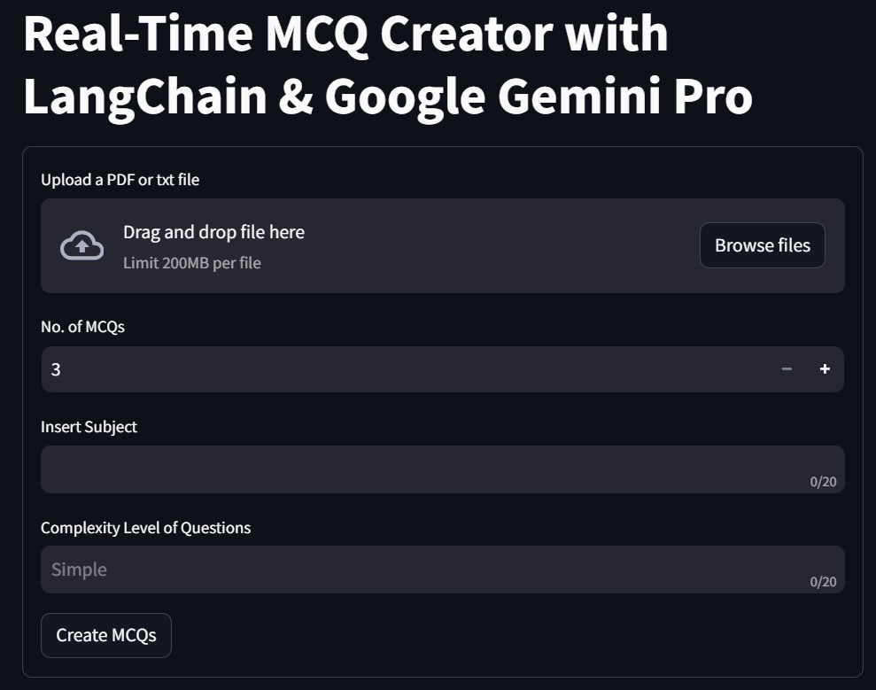
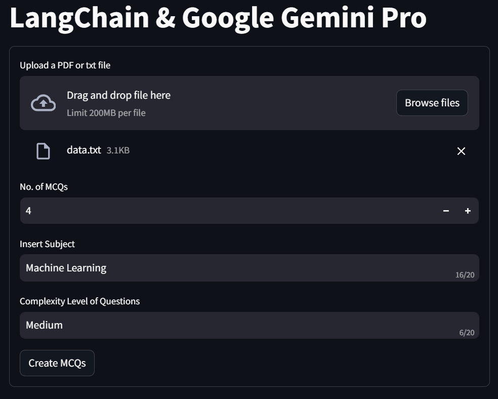
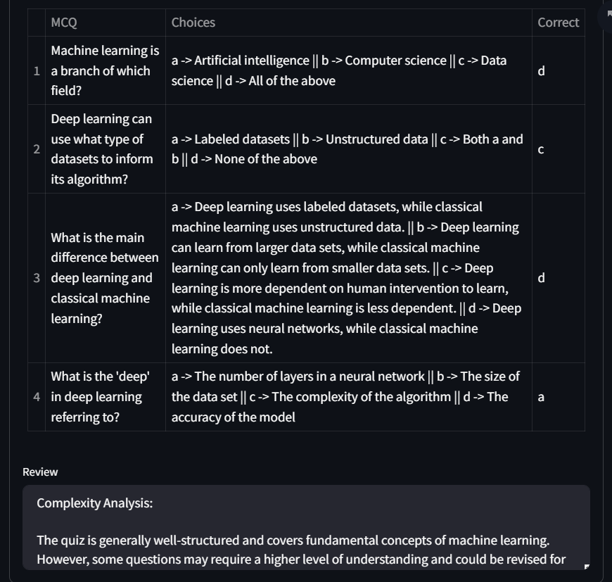

### Real Time MCQ Generation

Overview:
Developed a real time MCQ creator using LangChain and Google Gemini.
User interface built using the Streamlit application.

Backend Model:
Utilized the LangChain framework and Gemini Pro model at the backend.
Gemini Pro processes user input and generates responses.

User Interaction:
Interface includes dialogue boxes for users to input Number of MCqs, Subject, Complexity Level of questions and a browse button to upload pdf or txt file.

Image 1: Represents the developed user interface, showcasing the design and layout.

Image 2: Depicts a user inputting their query into the dialogue box for and uploading data file.

Image 3: Illustrates the MCQs generated by the application based on the user's input.
